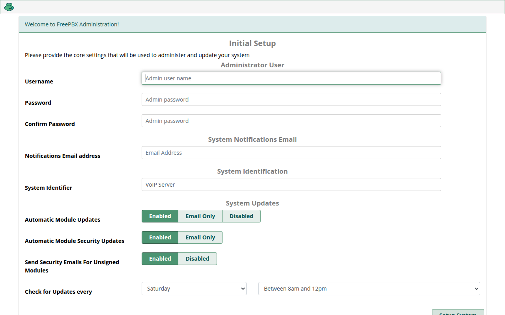

# FreePBX 17 Docker Container

🚀 **Production-ready FreePBX 17 + Asterisk container** for VoIP deployments — Debian and Alpine variants, Asterisk 18–22.

👉 **Deutsche Version:** [README.de.md](README.de.md)


## Table of Contents

- [Features](#-features)
- [Architecture](#-architecture)
- [Image Tags](#-image-tags)
- [Requirements](#-requirements)
- [Quick Start](#-quick-start)
- [Setup (Compose & .env)](#-setup-compose--env)
- [Environment Variables](#-environment-variables)
- [Ports](#-ports)
- [Volumes & Backup](#-volumes--backup)
- [Reverse Proxy (nginx, Traefik, Caddy)](#-reverse-proxy-nginx-traefik-caddy)
- [TLS / HTTPS](#-tls--https)
- [Screenshots](#-screenshots)
- [Health Checks & Monitoring](#-health-checks--monitoring)
- [Build & Development](#-build--development)
- [CI & Automation](#-ci--automation)
- [Troubleshooting](#-troubleshooting)
- [Security Notes](#-security-notes)
- [Project Structure](#-project-structure)
- [Contributing & Support](#-contributing--support)

## ✨ Features

- ✅ **FreePBX 17** with web management interface
- ✅ **Asterisk 18–22** (see [tags](#-image-tags)), built from source with MP3 (`format_mp3`) and crypto (`res_crypto`) support
- ✅ **Multi-service orchestration** via Supervisor (MariaDB → Asterisk → PHP-FPM → Nginx)
- ✅ **Debian 12 and Alpine 3.20** variants (Alpine images are ~20% smaller)
- ✅ **Persistent named volumes** for config, database, web files and logs
- ✅ **Health checks**, structured logging, automated build tooling (`build.sh`, `Makefile`)
- ✅ **Reverse-proxy ready** (examples for nginx, Traefik and Caddy below)

## 🏗️ Architecture

One container runs four supervised services in strict start order:

| Priority | Service | Description |
|----------|---------|-------------|
| 10 | **MariaDB 10.11** | Database backend (`mysqld`) |
| 20 | **Asterisk** | PBX core engine (`asterisk -f`) |
| 30 | **PHP-FPM 8.2** | FreePBX web backend |
| 40 | **Nginx** | Web server frontend (port 80) |

On **first boot** the entrypoint (`entrypoint.sh`) initializes MariaDB, starts Asterisk temporarily, runs the FreePBX installer (`./install -n`), then hands over to Supervisord. First boot takes **2–5 minutes** — watch `docker logs <container>`.

> **Note:** `supervisorctl status` works out of the box inside the container (a `unix_http_server` section is included).

## 🏷️ Image Tags

Images: `mleem97/lnxr-freepbx:<tag>` ([Docker Hub](https://hub.docker.com/repository/docker/mleem97/lnxr-freepbx)).

| Tag | Base | Asterisk | Notes |
|-----|------|----------|-------|
| `17` | Debian 12 | 21 | Production image (FreePBX 17) |
| `dev` | Debian 12 | 21 | Built from `main`, for development/testing |
| `17-alpine` | Alpine 3.20 | 21 | Smaller production alternative |
| `18`, `18-alpine` | Debian 12 / Alpine 3.20 | **18.26.4** (pinned, EOL branch) | |
| `19`, `19-alpine` | Debian 12 / Alpine 3.20 | **19.8.1** (pinned, EOL branch) | |
| `20`, `20-alpine` | Debian 12 / Alpine 3.20 | 20 (current branch) | |
| `21`, `21-alpine` | Debian 12 / Alpine 3.20 | 21 (current branch) | Same Asterisk as `17`/`17-alpine` |
| `22`, `22-alpine` | Debian 12 / Alpine 3.20 | 22 (current branch) | Newest |

> There is **no `latest` tag**. Tags `18`/`19` are pinned to the last releases of their (end-of-life) branches because `*-current` symlinks no longer exist for them. FreePBX 17 supports Asterisk 18–22.

```bash
docker pull mleem97/lnxr-freepbx:17          # Debian production
docker pull mleem97/lnxr-freepbx:17-alpine   # Alpine production
docker pull mleem97/lnxr-freepbx:22          # Newest Asterisk, Debian
```

## 📋 Requirements

- Docker Engine 24+ with Compose v2 (`docker compose`)
- **2 GB RAM minimum**, 4 GB+ recommended for production
- **amd64** architecture
- Published ports (see [Ports](#-ports)); RTP range `10000–20000/udp` must be reachable for audio

## 🚀 Quick Start

### From Docker Hub (recommended)

```bash
docker run -d --name freepbx \
  --restart unless-stopped \
  -p 8080:80 -p 8443:443 \
  -p 5060:5060/udp -p 5061:5061/udp \
  -p 10000-20000:10000-20000/udp \
  -v freepbx_db:/var/lib/mysql \
  -v freepbx_config:/etc/asterisk \
  -v freepbx_www:/var/www/html \
  -e TZ=Europe/Berlin \
  mleem97/lnxr-freepbx:17
```

Open **http://localhost:8080** after a few minutes (first boot installs FreePBX).

### From source (development)

```bash
git clone https://github.com/mleem97/PBX.git
cd PBX

# Debian dev container
make dev-deploy        # or: ./build.sh dev && docker compose up -d

# Alpine variant
docker compose -f docker-compose.alpine.yml up -d --build
```

## ⚙️ Setup (Compose & .env)

Three Compose files are included:

| File | Purpose |
|------|---------|
| `docker-compose.yml` | Development (builds `dockerfile`, tag `dev`) |
| `docker-compose.alpine.yml` | Alpine variant (builds `dockerfile.alpine`, tag `17-alpine`) |
| `docker-compose.prod.yml` | Production (pulls `mleem97/lnxr-freepbx:<tag>`, configurable via `.env`) |

```bash
# 1. Create env file
cp .env.example .env.prod

# 2. Edit .env.prod (ports, timezone, image tag, SSL path)
# 3. Start production
docker compose -f docker-compose.prod.yml --env-file .env.prod up -d

# Or use the deploy helper (pull → recreate → wait-for-healthy)
./deploy.sh
```

Useful Makefile targets: `make help` lists all. Most used: `make build-dev|build-prod|build-alpine|build-versions`, `make push-*`, `make up-dev|up-prod|up-alpine`, `make down-*`, `make logs|logs-prod`, `make shell-dev|shell-prod`, `make asterisk-cli`, `make status`, `make clean`.

## 🔧 Environment Variables

### Production Compose (`docker-compose.prod.yml` ← `.env` / `.env.prod`)

| Variable | Default | Description |
|----------|---------|-------------|
| `IMAGE_REGISTRY` | `mleem97` | Registry/namespace of the image |
| `IMAGE_TAG` | `17` | Image tag to run (e.g. `17`, `22`, `17-alpine`) |
| `HTTP_PORT` | `8080` | Host port → container port 80 (web UI) |
| `HTTPS_PORT` | `8443` | Host port → container port 443 (reserved, see [TLS](#-tls--https)) |
| `SIP_PORT` | `5060` | Host port → SIP signaling UDP |
| `SIPS_PORT` | `5061` | Host port → secure SIP UDP |
| `RTP_START` / `RTP_END` | `10000` / `20000` | Host RTP range → container `10000–20000/udp` |
| `TIMEZONE` | `Europe/Berlin` | Mapped to container `TZ` |
| `MYSQL_ROOT_PASSWORD` | *(empty)* | **Reserved for future use** — currently not applied to MariaDB |
| `SSL_CERT_PATH` | `./ssl` | Host dir mounted read-only to `/etc/ssl/certs/freepbx` |
| `COMPOSE_FILE` / `ENV_FILE` | (deploy.sh only) | Compose/env file selection for `./deploy.sh` |

### Container runtime

| Variable | Default | Description |
|----------|---------|-------------|
| `TZ` | `Europe/Berlin` | Container timezone |

### Build (`build.sh`)

| Variable | Default | Description |
|----------|---------|-------------|
| `DOCKER_HUB_USER` | `mleem97` | Namespace used when pushing |
| `DOCKER_REGISTRY` | `docker.io` | Registry used when pushing |

`./build.sh [dev|prod|alpine|versions|all] [--push]` — `versions` builds tags `18–22` (+ `-alpine` each); EOL branches 18/19 use pinned release tarballs (see `tarball_for_version` in `build.sh`).

## 🔌 Ports

| Container port | Protocol | Purpose | Typical host mapping |
|----------------|----------|---------|----------------------|
| `80` | TCP | FreePBX web UI (HTTP) | `8080` |
| `443` | TCP | Reserved (no TLS block by default, see [TLS](#-tls--https)) | `8443` |
| `5060` | UDP | SIP signaling | `5060` |
| `5061` | UDP | Secure SIP (TLS) | `5061` |
| `10000–20000` | UDP | RTP media (audio) | `10000–20000` |

> SIP and RTP **must** be published directly on the host (UDP port-forwarding). Only the HTTP web UI belongs behind a reverse proxy — L7 proxies cannot handle the dynamic RTP range (see below).

Firewall example (UFW):

```bash
sudo ufw allow 8080/tcp
sudo ufw allow 5060,5061/udp
sudo ufw allow 10000:20000/udp
```

## 💾 Volumes & Backup

Named volumes per Compose file (prod volumes are suffixed `_prod`, e.g. `freepbx_db_prod`):

| Mount point | Content | Critical? |
|-------------|---------|-----------|
| `/var/lib/mysql` | MariaDB databases | ⭐ most critical |
| `/etc/asterisk` | Asterisk configuration | yes |
| `/var/lib/asterisk` | Asterisk runtime data | yes |
| `/var/www/html` | FreePBX web files | yes |
| `/var/log` (`/var/log/asterisk` in dev) | Logs | no |
| `/var/spool/asterisk` | Call processing data | no |

Backup example:

```bash
docker run --rm \
  -v freepbx_db_prod:/source/db \
  -v freepbx_etc_asterisk_prod:/source/config \
  -v $(pwd)/backup:/backup \
  alpine tar czf /backup/freepbx-backup-$(date +%Y%m%d).tar.gz -C /source .
```

## 🔀 Reverse Proxy (nginx, Traefik, Caddy)

**Rule of thumb:** proxy **only the web UI** (container port 80). Keep SIP (`5060–5061/udp`) and RTP (`10000–20000/udp`) published directly on the Docker host — put the proxy on the same host or a machine that forwards those UDP ports 1:1.

FreePBX behind a TLS-terminating proxy runs plain HTTP internally; if login loops occur, set **“Redirect to HTTPS” off** in FreePBX *Admin → System Admin → HTTPS Setup* (or *Advanced Settings → HTTP(S)*), since TLS is handled by the proxy.

### Option A: nginx (separate host or container)

```nginx
# /etc/nginx/sites-available/freepbx
upstream freepbx { server 127.0.0.1:8080; }

server {
    listen 80;
    server_name pbx.example.com;
    return 301 https://$host$request_uri;  # ACME challenge location goes here if needed
}

server {
    listen 443 ssl;
    server_name pbx.example.com;

    ssl_certificate     /etc/letsencrypt/live/pbx.example.com/fullchain.pem;
    ssl_certificate_key /etc/letsencrypt/live/pbx.example.com/privkey.pem;

    client_max_body_size 20M;

    location / {
        proxy_pass http://freepbx;
        proxy_set_header Host $host;
        proxy_set_header X-Real-IP $remote_addr;
        proxy_set_header X-Forwarded-For $proxy_add_x_forwarded_for;
        proxy_set_header X-Forwarded-Proto $scheme;
    }

    # UCP / WebSocket support
    location /ws {
        proxy_pass http://freepbx;
        proxy_http_version 1.1;
        proxy_set_header Upgrade $http_upgrade;
        proxy_set_header Connection "upgrade";
        proxy_set_header Host $host;
        proxy_set_header X-Forwarded-Proto $scheme;
    }
}
```

### Option B: Traefik (labels on the FreePBX service)

Traefik terminates TLS for the web UI; SIP/RTP stay on host ports.

```yaml
services:
  freepbx:
    image: mleem97/lnxr-freepbx:17
    ports:
      - "5060:5060/udp"
      - "5061:5061/udp"
      - "10000-20000:10000-20000/udp"
    labels:
      - "traefik.enable=true"
      - "traefik.http.routers.freepbx.rule=Host(`pbx.example.com`)"
      - "traefik.http.routers.freepbx.entrypoints=websecure"
      - "traefik.http.routers.freepbx.tls.certresolver=letsencrypt"
      - "traefik.http.services.freepbx.loadbalancer.server.port=80"
    environment:
      - TZ=Europe/Berlin
    volumes:
      - freepbx_db:/var/lib/mysql
      - freepbx_config:/etc/asterisk
      - freepbx_www:/var/www/html
```

> Do **not** route SIP/RTP through Traefik TCP/UDP routers — publish them on the host as above.

### Option C: Caddy (simplest, automatic HTTPS)

```
pbx.example.com {
    reverse_proxy 127.0.0.1:8080
}
```

```bash
# Container publishes only what Caddy needs + VoIP UDP directly:
docker run -d --name freepbx --restart unless-stopped \
  -p 127.0.0.1:8080:80 \
  -p 5060:5060/udp -p 5061:5061/udp -p 10000-20000:10000-20000/udp \
  -v freepbx_db:/var/lib/mysql -v freepbx_config:/etc/asterisk -v freepbx_www:/var/www/html \
  mleem97/lnxr-freepbx:17
```

## 🔒 TLS / HTTPS

The container's bundled nginx serves **plain HTTP on port 80**. Port 443 is exposed but has **no TLS server block by default** — terminate TLS at your reverse proxy (recommended, see above).

If you must serve TLS from the container itself, mount certificates to `/etc/ssl/certs/freepbx:ro` (see `SSL_CERT_PATH`) and add a `listen 443 ssl;` server block (with `ssl_certificate` / `ssl_certificate_key` pointing at the mounted files) to a custom nginx config.

## 📸 Screenshots

Fresh first boot — FreePBX initial setup wizard (`/admin/config.php`):



## 🩺 Health Checks & Monitoring

Production Compose includes a health check (`curl http://localhost/admin/config.php`, 30s interval, 120s start period).

```bash
# Service overview (inside container)
docker exec -it lnxr-freepbx-prod supervisorctl status
# Restart one service
docker exec -it lnxr-freepbx-prod supervisorctl restart asterisk
# Asterisk CLI
docker exec -it lnxr-freepbx-prod asterisk -r
asterisk -rx "core show version"
asterisk -rx "pjsip show endpoints"
# Logs
docker logs lnxr-freepbx-prod
docker exec -it lnxr-freepbx-prod tail -f /var/log/asterisk-supervisor.log
```

## 🛠️ Build & Development

```bash
./build.sh dev              # Debian dev image (lnxr-freepbx:dev)
./build.sh prod             # retag dev -> 17
./build.sh alpine           # Alpine image (lnxr-freepbx:17-alpine)
./build.sh versions         # tags 18-22 + -alpine variants
./build.sh all --push       # dev + 17 + 17-alpine, then push to Docker Hub
```

Dockerfiles:

| File | Base | Used for |
|------|------|----------|
| `dockerfile` | Debian 12, single-stage | Legacy / reference (dev Compose uses `dockerfile` via `docker-compose.yml`... actually `docker-compose.yml` builds `dockerfile`) |
| `dockerfile.optimized` | Debian 12, multi-stage | `dev`, `17`, `18`–`22` (supports `ASTERISK_VERSION` / `ASTERISK_TARBALL_URL` build args) |
| `dockerfile.alpine` | Alpine 3.20, multi-stage | `17-alpine`, `18-alpine`–`22-alpine` (musl-compatible Asterisk build, same build args) |

> The Alpine build compiles Asterisk on musl libc, including small compatibility patches for musl (BSD `__P`/`__BEGIN_DECLS`/`ALLPERMS` macros, recursive static mutexes, `-rdynamic` linking). See comments in `dockerfile.alpine`.

## 🤖 CI & Automation

`.github/workflows/ci.yml` runs on every push to `main`, on pull requests, weekly (Mondays, 03:00 UTC), and manually:

- **Build matrix**: all 13 tags (`dev`, `17`, `17-alpine`, `18–22` + `-alpine`) for `linux/amd64` + `linux/arm64`, pushed to Docker Hub (skipped for PRs)
- **Smoke tests**: fresh first-boot install (`17`, `17-alpine`, `22`) must reach healthy supervisord + HTTP 200 — see `tests/smoke.sh` (also runnable locally: `./tests/smoke.sh <image>`)
- **Trivy scans**: HIGH/CRITICAL findings uploaded as SARIF to code scanning (informational, non-blocking)
- **Cosign signatures**: keyless Sigstore signing of every pushed image — verify with `cosign verify --certificate-identity-regexp '.*' --certificate-oidc-issuer https://token.actions.githubusercontent.com mleem97/lnxr-freepbx:<tag>`

Required repository secrets (*Settings → Secrets → Actions*): `DOCKERHUB_USERNAME`, `DOCKERHUB_TOKEN` (Docker Hub access token).

## 🐛 Troubleshooting

| Symptom | Likely cause / fix |
|---------|--------------------|
| Container exits during first boot | Read `docker logs`: FreePBX install needs 2–5 min; genuine failures print `FEHLER: …` with a reason |
| `libasteriskssl.so.1: cannot open shared object file` | Fixed in current images (`--libdir=/usr/lib` + `ld.so.conf` + build-time `ldd` check). Re-pull the tag. |
| Web UI `HTTP 500` | PHP-FPM runs as `asterisk` (fixed in current images). Re-pull; check `freepbx_error.log`. |
| Web UI `404` on fresh boot | Install did not finish — check logs for the failing step (node/cron/gpg/php extensions are now all included). |
| No audio / one-way audio | RTP ports `10000–20000/udp` not reachable; set NAT + external IP in FreePBX *Settings → Asterisk SIP Settings* (chan_pjsip). |
| SIP registration fails behind NAT | Configure external address, local networks, and qualify in SIP Settings. |
| MariaDB won't start | Check volume permissions (`chown mysql:mysql` is applied at boot); inspect `mariadb-supervisor.log`. |
| `supervisorctl` fails | Uses `/run/supervisord.sock` (configured); on Debian call `supervisorctl -c /etc/supervisor/conf.d/supervisord.conf` if needed. |

## 🔐 Security Notes

- Put the web UI behind HTTPS (reverse proxy) before exposing it to the internet.
- SIP/RTP ports must be reachable, but restrict web ports (`8080`/`8443`) to trusted networks where possible.
- `MYSQL_ROOT_PASSWORD` is currently **not applied** (reserved) — set MariaDB credentials inside the container if needed.
- Keep images updated: `docker compose -f docker-compose.prod.yml pull && docker compose -f docker-compose.prod.yml up -d`.
- The container does **not** run a cron daemon (the `crontab` binary exists for the installer); FreePBX scheduled jobs requiring cron need an external scheduler or a sidecar.

## 📂 Project Structure

```
PBX/
├── dockerfile                 # Debian single-stage (legacy/reference)
├── dockerfile.optimized       # Debian multi-stage (dev, 17, 18-22)
├── dockerfile.alpine          # Alpine multi-stage (17-alpine, 18-22-alpine)
├── docker-compose.yml         # Development (Debian dev)
├── docker-compose.alpine.yml  # Alpine variant
├── docker-compose.prod.yml    # Production (configurable via .env)
├── .env.example               # Template for .env / .env.prod
├── entrypoint.sh              # First-boot init (MariaDB, Asterisk, FreePBX install)
├── supervisord.conf           # Supervisor services (Debian)
├── supervisord.alpine.conf    # Supervisor services (Alpine)
├── freepbx-nginx.conf         # Nginx site (Debian, PHP-FPM socket)
├── freepbx-nginx.alpine.conf  # Nginx site (Alpine, PHP-FPM via 127.0.0.1:9000)
├── build.sh                   # Build & push automation (dev|prod|alpine|versions|all)
├── deploy.sh                  # Production deploy helper
├── Makefile                   # Shortcuts (make help)
└── .github/
    └── copilot-instructions.md
```

## 🤝 Contributing & Support

1. Fork → feature branch → commit → push → Pull Request.
2. Please test-build the image you touched (`./build.sh dev` or `./build.sh alpine`).

- 🐛 **Issues:** [GitHub Issues](https://github.com/mleem97/PBX/issues)
- 🐳 **Images:** [Docker Hub](https://hub.docker.com/repository/docker/mleem97/lnxr-freepbx)
- 📖 **FreePBX docs:** [wiki.freepbx.org](https://wiki.freepbx.org/) · 💬 [Community Forum](https://community.freepbx.org/) · 📞 [Asterisk docs](https://docs.asterisk.org/)

License: MIT — see [LICENSE](LICENSE).
